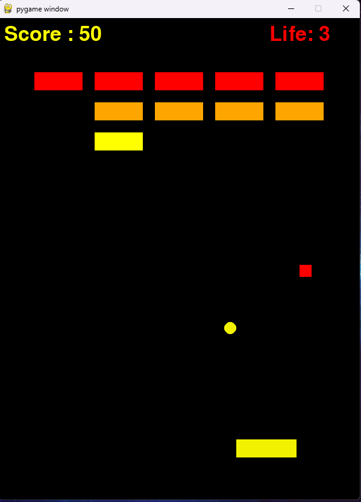

# 블록 깨기 게임

## 게임 설명

**블록 깨기 게임**은 패들을 조종하여 공을 튕겨서 화면에 있는 블록들을 모두 깨는 게임입니다.

블록이 깨질 때마다 아이템이 랜덤하게 생성됩니다.

## 주요 기능
- 공을 튕겨서 블록을 깨기.
- 블록이 부서지면 랜덤 아이템을 수집.
- 생명이 0이 되면 게임 오버.
- 모든 블록을 깨면 게임 클리어.
- 아이템을 통해 여러 개의 공을 얻을 수 있음.

## 요구 사항
- Python 3.x
- Pygame 라이브러리 (게임 그래픽을 위한 라이브러리)

## 설치 방법

1. 저장소를 클론합니다:

2. Pygame 라이브러리를 설치합니다:

3. 게임을 실행합니다:

## 게임 조작법
- **왼쪽 화살표**: 패들 왼쪽으로 이동.
- **오른쪽 화살표**: 패들 오른쪽으로 이동.
- **스페이스바**: 게임 시작 또는 재시작.
- **Esc 키**: 게임 종료.

## 설정

게임의 설정 값들은 `config.py` 파일에서 정의되어 있습니다. 게임 플레이를 사용자에 맞게 조정할 수 있습니다.

- **num_blocks**: 블록의 수 (행과 열로 설정).
- **block_size**: 각 블록의 크기.
- **display_dimension**: 게임 화면 해상도.
- **life**: 플레이어의 초기 생명 수.

## 기여

이 프로젝트는 게임 개발 학습의 일환으로 만들어졌습니다. 게임의 인터페이스와 로직은 Pygame을 사용하여 작성되었습니다.

## 라이선스
이 프로젝트는 [MIT 라이선스](LICENSE)를 따릅니다.

## Contributor
anjihan9058
